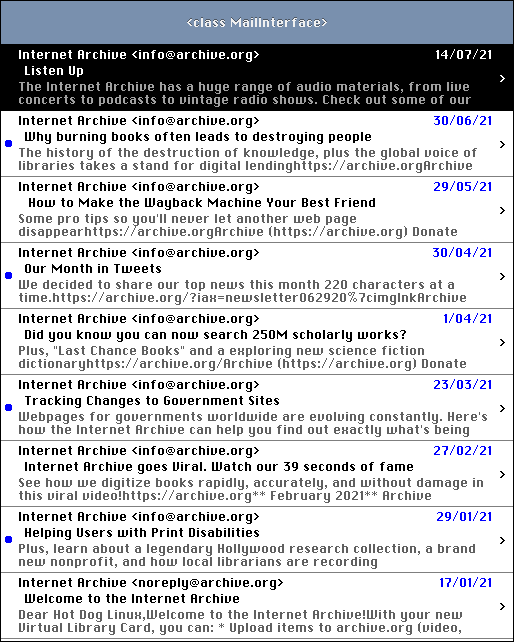

# REMOULADE Email Client

Simple Email Client For IMAP Inspired By MH

## Screenshots

## Overview

Download an IMAP mailbox to a local directory.

Emails are regular files, each file is an email.

IMAP configuration files are stored in the current directory.

Configuration files are text and human-readable.

Emails are basically text, but parts are often encoded in various ways.

Commands are run that operate on the current directory and files in that
directory.

There is no specified directory structure, emails are simply regular files
that can be stored anywhere.

'socat' is required for communicating over the network.

REMOULADE is an acronym that stands for **R**ead **E**lectronic **M**ail
**O**n **U**nix, **L**inux, **A**nd **D**erivative **E**nvironments

The correct pronunciation of REMOULADE is to imagine that you have a mouth
full of potatoes while saying 'remoulade'.

## How to compile

$ sh build.sh

This results in the binary file 'remoulade'.

## How to setup local directory

$ mkdir inbox

$ cd inbox

$ /path/to/remoulade init

Answer the prompts to enter your username, password, and mailbox. For the mailbox, enter 'inbox' unless you want a specific mailbox. The information will be saved in the dotfiles '.username', '.password', and '.mailbox' in the current directory. Please note that this saves the password to a file in plain text, which may be a security risk. Caution is advised.

To download all the messages in the specified mailbox:

$ socat openssl:example.com:993 system:'/path/to/remoulade download'

If there are problems with certificate verification, try:

$ socat openssl:example.com:993,verify=0 system:'/path/to/remoulade download'

The email messages should now be regular files in the current directory.

## How to update local directory

$ cd inbox

$ socat openssl:example.com:993 system:'/path/to/remoulade update'

If there are problems with certificate verification, try:

$ socat openssl:example.com:993,verify=0 system:'/path/to/remoulade update'

This uses IMAP QRESYNC to perform the update.

## How to wait for a change using IMAP IDLE

$ cd inbox

$ socat openssl:example.com:993 system:'/path/to/remoulade idle'

If there are problems with certificate verification, try:

$ socat openssl:example.com:993,verify=0 system:'/path/to/remoulade idle'

This uses IMAP IDLE, waits for an EXISTS message, then exits.

## Notes

This is a rather quick and dirty implementation.

## Legal

Copyright (c) 2021 Arthur Choung. All rights reserved.

Email: arthur -at- hotdoglinux.com

Released under the GNU General Public License, version 3.

For details on the license, refer to the LICENSE file.

